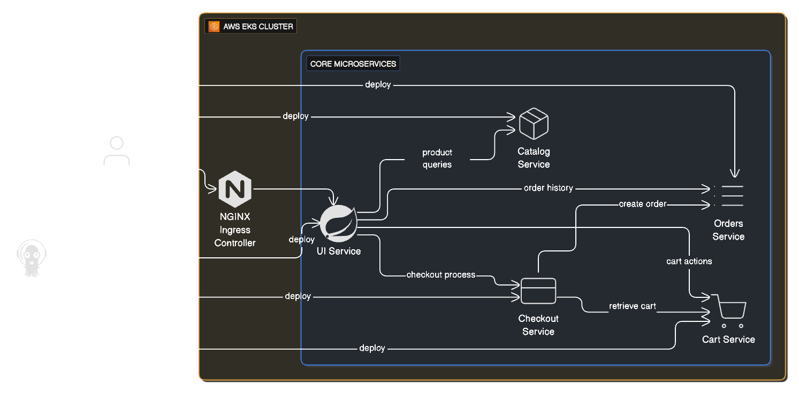
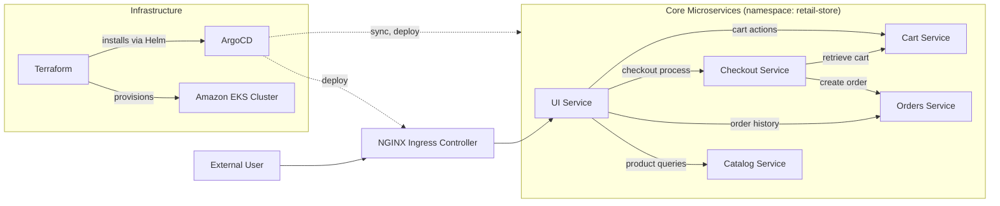

# Retail Microservices Platform — DevOps & GitOps on AWS EKS

A cloud-native retail storefront (UI, Catalog, Cart, Checkout, Orders) deployed to **Amazon EKS**, provisioned with **Terraform**, and continuously reconciled with **ArgoCD** using a GitOps workflow.



## Contents

- [Architecture](#architecture)
- [Tech Stack](#tech-stack)
- [Repository Structure](#repository-structure)
- [Prerequisites](#prerequisites)
- [Deploying the Platform](#deploying-the-platform)
- [Accessing the Application](#accessing-the-application)
- [Cleanup](#cleanup)
- [Known Gaps & Roadmap](#known-gaps--roadmap)
- [Credits](#credits)

## Architecture



ArgoCD watches Helm charts under `src/*/chart` and reconciles five `Application` resources (`cart`, `catalog`, `checkout`, `orders`, `ui`) into the `retail-store` namespace. NGINX Ingress fronts the cluster behind an AWS NLB; the UI service is the single entry point that fans out to the other four services.

> **Note:** the ArgoCD `Application` manifests in this repo currently point their `repoURL` at the upstream [`LondheShubham153/retail-store-sample-app`](https://github.com/LondheShubham153/retail-store-sample-app) repo, not at this fork — see [Known Gaps](#known-gaps--roadmap).

## Tech Stack

| Layer | Tooling |
|---|---|
| Infrastructure as Code | Terraform (VPC, EKS via `terraform-aws-modules`, EKS Auto Mode) |
| Container Orchestration | Amazon EKS (Kubernetes 1.33) |
| GitOps / CD | ArgoCD (Helm-installed, auto-sync + self-heal) |
| Ingress | NGINX Ingress Controller behind an AWS NLB |
| TLS | cert-manager |
| Services | Java/Spring Boot (UI, Cart, Orders), Go (Catalog), NestJS/TypeScript (Checkout) |
| Data stores | DynamoDB-local (Cart), MySQL (Catalog), PostgreSQL + RabbitMQ (Orders), Redis (Checkout) |
| Container images | Public AWS sample images (`public.ecr.aws/aws-containers/retail-store-sample-*`) |

## Repository Structure

```
.
├── argocd/
│   ├── projects/retail-store-project.yaml   # AppProject: allowed repos, destinations, resource whitelist
│   └── applications/                        # One ArgoCD Application per microservice
├── docs/images/                             # Architecture diagrams and screenshots
├── src/
│   ├── cart/       # Java/Spring Boot — Helm chart + Dockerfile
│   ├── catalog/    # Go — Helm chart + Dockerfile
│   ├── checkout/   # NestJS/TypeScript — Helm chart + Dockerfile
│   ├── orders/     # Java/Spring Boot — Helm chart + Dockerfile
│   ├── ui/         # Java/Spring Boot (Thymeleaf) — Helm chart + Dockerfile
│   └── app/chart/  # Umbrella chart wiring all services together
└── terraform/
    ├── main.tf         # VPC + EKS cluster
    ├── addons.tf       # cert-manager, NGINX Ingress via eks-blueprints-addons
    ├── argocd.tf        # ArgoCD Helm install + AppProject/Application sync
    ├── security.tf     # Security group rules
    ├── locals.tf / variables.tf / outputs.tf / versions.tf
    └── README.md       # Terraform-specific instructions
```

## Prerequisites

- AWS account with credentials configured (`aws configure` or an assumed role)
- [Terraform](https://developer.hashicorp.com/terraform/downloads) >= 1.0
- [kubectl](https://kubernetes.io/docs/tasks/tools/)
- [Helm](https://helm.sh/docs/intro/install/) (used implicitly by Terraform's `helm` and `kubectl` providers)

## Deploying the Platform

### 1. Provision infrastructure

```bash
cd terraform
terraform init
terraform plan
terraform apply
```

This creates a VPC (3 AZs, public + private subnets), an EKS cluster in Auto Mode, installs the NGINX Ingress Controller and cert-manager via the `eks-blueprints-addons` module, then installs ArgoCD via Helm and applies the `AppProject`/`Application` manifests from `../argocd`.

The cluster name gets a random 4-character suffix (e.g. `retail-store-a1b2`) to avoid collisions between deployments.

### 2. Configure kubectl

```bash
aws eks update-kubeconfig --region us-west-2 --name $(terraform output -raw cluster_name)
```

### 3. Verify ArgoCD synced the applications

```bash
kubectl get applications -n argocd
kubectl get pods -n retail-store
```

## Accessing the Application

**ArgoCD UI:**

```bash
kubectl -n argocd get secret argocd-initial-admin-secret -o jsonpath='{.data.password}' | base64 -d
kubectl port-forward svc/argocd-server -n argocd 8080:443
# https://localhost:8080 — user: admin
```

**Retail storefront:**

```bash
kubectl get svc -n ingress-nginx ingress-nginx-controller \
  -o jsonpath='{.status.loadBalancer.ingress[0].hostname}'
```

Open the returned NLB hostname in a browser.

## Cleanup

```bash
cd terraform
terraform destroy
```

This removes the EKS cluster, VPC, and all associated resources. There is no state backup step configured, so confirm you no longer need anything before destroying.

## Known Gaps & Roadmap

This repo's docs describe a full CI/CD loop (GitHub Actions building and pushing images to ECR, ArgoCD syncing from this fork). As currently committed, a few pieces of that picture aren't wired up yet:

- **No GitHub Actions workflow exists** (`.github/workflows/` is absent) and **no ECR resources are defined in Terraform**. All five Helm charts pull prebuilt public images (`public.ecr.aws/aws-containers/retail-store-sample-*:1.2.2`) rather than images built from `src/`.
- **ArgoCD `Application` manifests source from an upstream repo**, not this one — `repoURL` is set to `https://github.com/LondheShubham153/retail-store-sample-app` in all five `argocd/applications/*.yaml` files. Editing `src/*/chart` here will not affect what gets deployed until these are repointed to this fork.
- **`imagePullSecrets: [regcred]` is set in every chart's `values.yaml`**, but no `regcred` Secret is created anywhere in this repo or the Terraform. Since the images are public, this is likely harmless, but it's worth confirming or removing.
- **`terraform/README.md` references `terraform.tfvars.example`**, which doesn't exist in the repo — the documented `cp terraform.tfvars.example terraform.tfvars` step will fail as written.

See the [manifest review](#) below (or ask me) for suggested fixes to each of these.

## Credits

Built on top of the [AWS Containers Retail Sample App](https://github.com/aws-containers/retail-store-sample-app), via the [LondheShubham153/retail-store-sample-app](https://github.com/LondheShubham153/retail-store-sample-app) fork used in the TrainWithShubham community DevOps course. This repository adds the Terraform + ArgoCD GitOps wiring on top.
